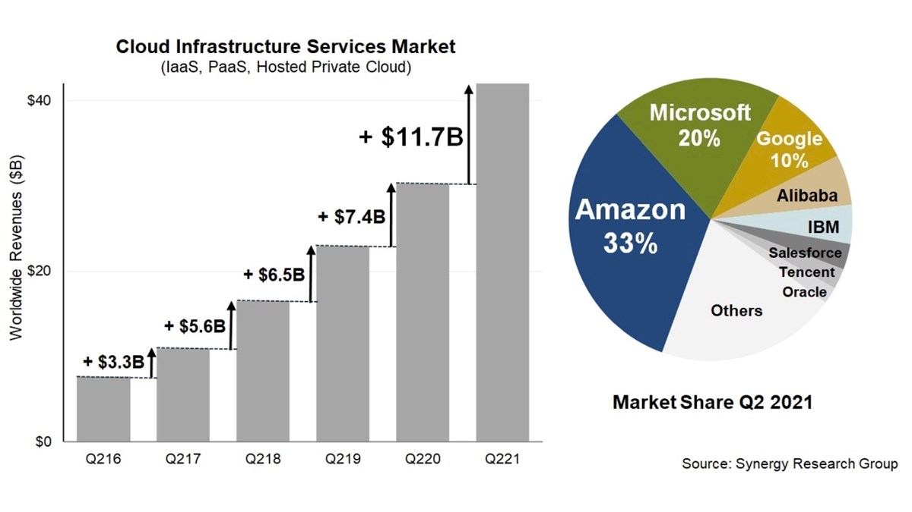

# What is cloud

# Overview of cloud
Cloud computing is a network of computing services like:
- Servers
- Databases
- Storage
- Different kinds of software applications
  
All these things can be completely remote from each other but connected through the network (or cloud)

This allows anyone with access to that cloud/network to utilize any of those technologies.

# History of cloud computing
In 1963, DARPA presented MIT with $2 million for Project MAC. The funding included a requirement for MIT to develop technology allowing for a “computer to be used by two or more people, simultaneously.”

In its early stages, the cloud expressed the empty space between the end user and the provider. In 1997, Professor Ramnath Chellapa of Emory University defined cloud computing as the new “computing paradigm, where the boundaries of computing will be determined by economic rationale, rather than technical limits alone.” This somewhat ponderous description rings true in describing the cloud’s evolution.

The cloud gained popularity as companies gained a better understanding of its services and usefulness. In 1999, Salesforce became a popular example of using cloud computing successfully. They used it to pioneer the idea of using the Internet to deliver software programs to the end users. The program (or application) could be accessed and downloaded by anyone with Internet access. Businesses could purchase the software in an on-demand, cost-effective manner without leaving the office.

In 2006, Amazon launched Amazon Web Services, which offers online services to other websites or clients. One of Amazon Web Services’ sites, called Amazon Mechanical Turk, provides a variety of cloud-based services, including storage, computation, and “human intelligence.” Another of Amazon Web Services’ sites is the Elastic Compute Cloud (EC2), allowing individuals to rent virtual computers and use their own programs and applications.

# What can you do with cloud computing?
- File storage.
- Big Data Analytics.
- Data backups and archiving.
- Disaster recovery.
- Software testing and development.
- Infrastructure as a service (IaaS) and Platform as a service (PaaS)
- Communication.
- Social Networking.

# What are the 4 main types of cloud computing?
- private clouds
- public clouds
- hybrid clouds (a mixed computing environment where applications are run using a combination of computing, storage, and services in different environments)
- multiclouds (multicloud refers to a company utilizing multiple cloud computing services from various public vendors within a single, heterogeneous architecture)
  
# What are the different types of cloud services?
- Infrastructure-as-a-Service (IaaS) - Infrastructure as a service is a cloud computing service model by means of which computing resources are supplied by a cloud services provider.
  
- Platforms-as-a-Service (PaaS) - Platform as a service (PaaS) or application platform as a service (PaaS) or platform-based service is a category of cloud computing services that allows     customers to provision, instantiate, run, and manage a modular bundle comprising a computing platform and one or more applications.

- Software-as-a-Service (SaaS) - Software as a service is a software licensing and delivery model in which software is licensed on a subscription basis and is centrally hosted.

# Advantages and disadvantages of cloud computing
Advantages:
- Disaster Recovery (DR).
- Access your data anywhere.
- Low cost. 
- Scalability.
- Security.
  
Disadvantages:
- Lack of total control. 
- Difficult to migrate. 
- Requires Internet.
- Fixed contracts.

# Opex vs Capex
Opex - operating expenses - day-to-day expenses that a company incurs to keep its business running
Capex - Capital expenditures - major purchases that a company makes

# Marketshare

# What are the 3 biggest cloud providers and what makes them popular?
1) Amazon Web Service 
2) Microsoft Azure
3) Google Cloud 

They are all very popular because they offer a huge range of services.

# What are the 4 pillars of DevOps and how do they relate to cloud computing?
- DevOps Culture and Mindset.
- Adapting Microservices.
- Building a Quality-Driven Mindset.
- Tools and Automation.

They relate to cloud computing 
  
# Case studies
Betabrand
- The company struggled with the maintenance difficulties and lack of scalability of the bare metal infrastructure supporting their operations. 
- In anticipation of 2017’s Black Friday increased web traffic, Betabrand migrated to a Google Cloud infrastructure managed by Kubernetes (Google Kubernetes Engine, or GKE). They experienced no issues related to the migration, and Black Friday 2017 was a success. 

# How does Cloud Computing work as a business model?
The business model for cloud providers is usually subscription based, so clients pay a set amount periodically for the services they utilise and re-negotiate if they need more services.

# What sorts of things do you usually need to pay for when using the cloud?
- Storage
- Different services