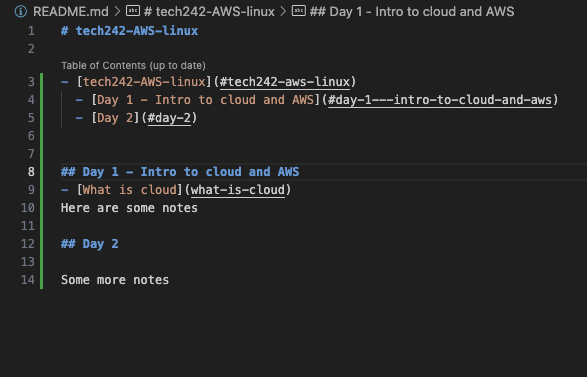

# tech242-AWS-linux

- [tech242-AWS-linux](#tech242-aws-linux)
  - [Day 1 - Intro to cloud and AWS](#day-1---intro-to-cloud-and-aws)
  - [Day 2](#day-2)
  - [How to change directory in Linux](#how-to-change-directory-in-linux)


## Day 1 - Intro to cloud and AWS
[What is cloud](Day1/what-is-cloud/README.md)<br>
[Aws basics](Day1/aws-basics/README.md)

## Day 2

Some more notes


## How to change directory in Linux

Change directory using this command: `cd <directory>`

Change directory using this command: 
```
cd <directory>
```