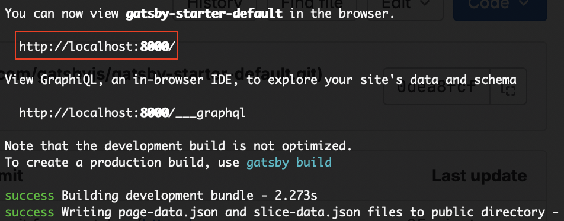

# Gatsby
Gatsby is a framework that makes it easy to run our application locally and build our application so it can be run.

## Installing Gatsby
To install Gatsby you will need node and NPM(node package manager).

1) To install node and NPM:
Mac: https://formulae.brew.sh/formula/node#default
Windows: https://medium.com/devops-with-valentine/how-to-install-node-js-and-npm-on-windows-10-windows-11-139442f90f12
2) You can check they are installed by using the commands `node --version` and `npm --version`.
3) Once those are installed you can use the command `npm install -g gatsby-cli` to install gatsby. If it does not work try adding `sudo` at the start.

## Creating a project with Gatsby
1) Now everything is installed you can create a new website/project with the command `gatsby new project-name`.
2) Now `cd` into the new project.
3) From here you can start the local development server by using the command `gatsby develop`.
4) You can now open the project in your browswer by going to the provided URL: 
   
5) You should see the default Gatsby page.

SIDENOTE: From here you can also build your project making it ready for deployment using the command `gatsby build`, it will create a folder called `public`.

## Linking your project with Gitlab
1) First create a new empty project on Gitlab.
2) Then copy the command provided that starts with `git remote add origin`.
3) Paste that command into the terminal in your new project.
4) Now do `git push origin main`.
5) All the files that Gatsby created will now be pushed to your gitlab project.