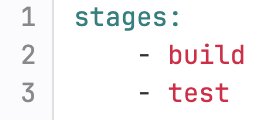
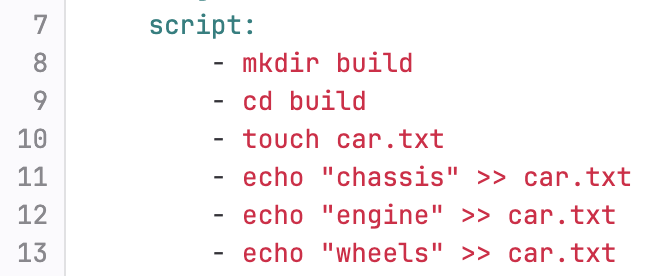
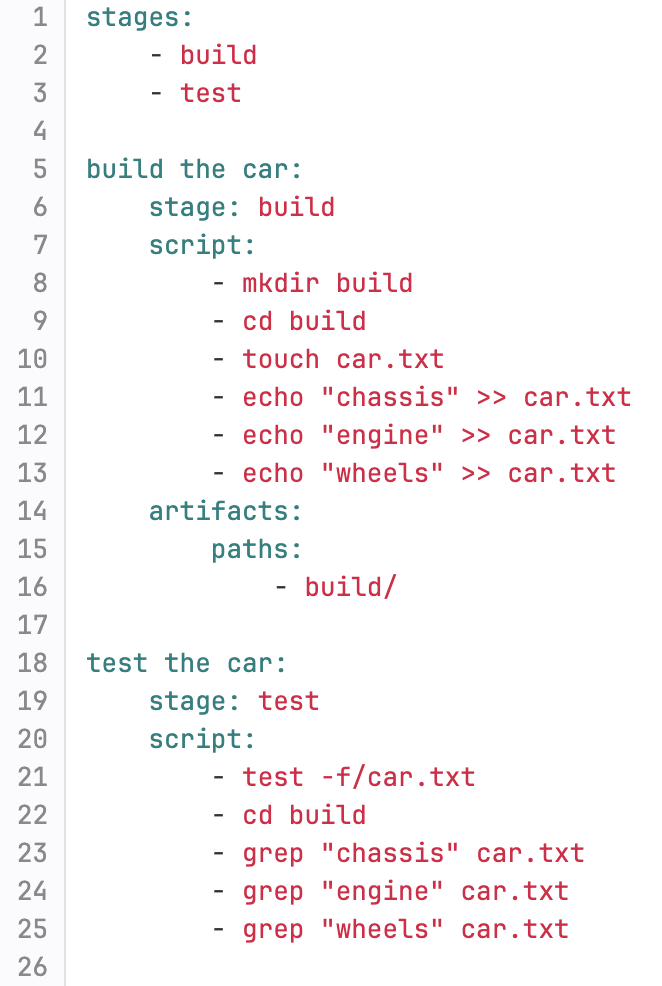

# Gitlab basics
# YAML
- YAML is the language we write our scripts in.
- YAML files end in `.yml`.
- It is a data serialization language
- Some people say YAML stands for Yet Another Markup Language and some people say it stands for YAML Ain't Markup Language

## Setting up a pipeline
1) Create a project.
2) Add a file called `.gitlab-ci.yml` in the root of the project.
3) Inside that file you can write your pipeline script.

## Writing pipeline scripts
1) Declare your stages, like this: 
   
2) Give your first step/job a name (just like a job from Jenkins), like this: 
   
3) Assign your job a stage, like this: 
   
4) Write `script:` followed by the commands you want your script to perform, like this: 
    
5) If you want to save any files/folders so they can be used in future jobs you need to declare them as artifacts, like this: 
    
6) The complete job should look similar to this: 
    
7) Add all the jobs you need and commit the changes.

SIDENOTE: If you do not specify a stage for your job it wil automatically be assigned to the test stage, even if no test stage was defined.

# Running your pipeline
1) Your pipeline will automatiacally run when you make a change to the `.gitlab-ci.yml` file.
2) To check it go to "build" on the lefthand side and then "pipelines".
3) Here you can see all of your previous builds, you will be able to see if they passed/failed overall and for each job.
4) If you want more detail, click in the id of your chosen build, then click one of the jobs and you will be able to the the terminal.
5) Here you can see where the issue was, and you can add commands like `ls` or `cat` to your scripts so you can debug in the console.

# If your pipeline is not running
Make sure that:
- You have named your file .gitlab-ci.yml (and not gitlab-ci.yml or .gitlab-ci.yaml)
- the pipeline file is in the root of the project and not inside a directory
- Auto DevOps is NOT enabled