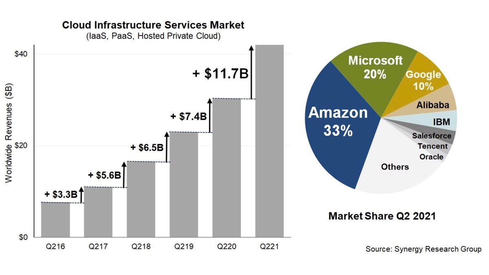

# What is cloud

# Overview of cloud
Cloud computing is a network of computing services like:
- Servers
- Databases
- Storage
- Different kinds of software applications
  
All these things can be completely remote from each other but connected through the network (or cloud)

This allows anyone with access to that cloud/network to utilize any of those technologies.

# History of cloud computing
In 1963, DARPA presented MIT with $2 million for Project MAC. The funding included a requirement for MIT to develop technology allowing for a “computer to be used by two or more people, simultaneously.”

In its early stages, the cloud expressed the empty space between the end user and the provider. In 1997, Professor Ramnath Chellapa of Emory University defined cloud computing as the new “computing paradigm, where the boundaries of computing will be determined by economic rationale, rather than technical limits alone.” This somewhat ponderous description rings true in describing the cloud’s evolution.

The cloud gained popularity as companies gained a better understanding of its services and usefulness. In 1999, Salesforce became a popular example of using cloud computing successfully. They used it to pioneer the idea of using the Internet to deliver software programs to the end users. The program (or application) could be accessed and downloaded by anyone with Internet access. Businesses could purchase the software in an on-demand, cost-effective manner without leaving the office.

In 2006, Amazon launched Amazon Web Services, which offers online services to other websites or clients. One of Amazon Web Services’ sites, called Amazon Mechanical Turk, provides a variety of cloud-based services, including storage, computation, and “human intelligence.” Another of Amazon Web Services’ sites is the Elastic Compute Cloud (EC2), allowing individuals to rent virtual computers and use their own programs and applications.

My take-away from this is that cloud computing is constantly evolving, having come from a basic computer being able to be accessed by 2 users simultaneously, to mow being a multitude of services that can be accessed by millions of users simultaneously.

# What can you do with cloud computing?
- File storage.
- Big Data Analytics.
- Data backups and archiving.
- Disaster recovery.
- Software testing and development.
- Infrastructure as a service (IaaS) and Platform as a service (PaaS)
- Communication.
- Social Networking.

My take-away from this is that cloud computing can be utilised in many different ways, for many different situations.

# What are the 4 main types of cloud computing?
- private clouds
- public clouds
- hybrid clouds (mix of public and private like database on site and app running in the cloud)
- multiclouds (multicloud refers to a company utilizing multiple cloud computing services from various public vendors within a single, heterogeneous architecture)

My main take-away from this is that users can mix and match cloud services from different providers to customize for their needs.
  
# What are the different types of cloud services?
- Infrastructure-as-a-Service (IaaS) - Infrastructure as a service is a cloud computing service model by means of which computing resources are supplied by a cloud services provider.
  
- Platforms-as-a-Service (PaaS) - Platform as a service (PaaS) or application platform as a service (PaaS) or platform-based service is a category of cloud computing services that allows customers to provision, instantiate, run, and manage a modular bundle comprising a computing platform and one or more applications.

- Software-as-a-Service (SaaS) - Software as a service is a software licensing and delivery model in which software is licensed on a subscription basis and is centrally hosted.

- Function-as-a-Service (FaaS) - Function as a service is a category of cloud computing services that provides a platform allowing customers to develop, run, and manage application functionalities without the complexity of building and maintaining the infrastructure typically associated with developing and launching an app.

My take-away from this is that there are different kinds of clouds, for different purposes, which I didnt realise before.

# Advantages and disadvantages of cloud computing
Advantages:
- Disaster Recovery (DR).
- Access your data anywhere.
- Low cost. 
- Scalability.
- Security.
  
Disadvantages:
- Lack of total control. 
- Difficult to migrate. 
- Requires Internet.
- Fixed contracts.

My take-away from this is that cloud computing can be very benificial but isn't the fix all answer to everything as it does have downsides.

# Opex vs Capex
Opex - operating expenses - day-to-day expenses that a company incurs to keep its business running 
Capex - Capital expenditures - major purchases that a company makes

My take-away from this is that you should always consider what will be cheaper in the long run, the initial capex or the ongoing opex.

# Marketshare

My take-away from this is that AWS is by far the most popular cloud provider.

# What are the 3 biggest cloud providers and what makes them popular?
1) Amazon Web Service 
2) Microsoft Azure
3) Google Cloud 

They are all very popular because they offer a huge range of services.

My take-away from this is that what makes a cloud provider successful is offering a large range of fully integrated services.

# What are the 4 pillars of DevOps and how do they relate to cloud computing?

- DevOps Culture and Mindset - Alignment of people, products and processes to foster effective collaboration. This relates to cloud computing because if everyone is using the same software, everyone can collaborate and help each other.
  
- Adapting Microservices - Microservices architecture breaks down large software projects into smaller, independent modules that communicate through APIs. This relates to cloud computing because we can use some of the microservices from a cloud.
  
- Building a Quality-Driven Mindset - Quality assurance goes beyond bug identification to preventing them from arising in the first place. Rapid software development, continuous testing, deployment, and monitoring are crucial components of DevOps. This relates to cloud computing because we can use services provided by the cloud for things like testing and deployment.

- Tools and Automation - Integrating a tool system that helps facilitate communication across the development, testing, and deployment stages is essential. This relates to cloud computing because we can use tools provided by the cloud.

My take-away from this is that all 4 pillars of DevOps relate to cloud computing in some way.
  
# Case studies
Betabrand
- The company struggled with the maintenance difficulties and lack of scalability of the bare metal infrastructure supporting their operations. 

- In anticipation of 2017’s Black Friday increased web traffic, Betabrand migrated to a Google Cloud infrastructure managed by Kubernetes (Google Kubernetes Engine, or GKE). They experienced no issues related to the migration, and Black Friday 2017 was a success. 

My take-away from this is that cloud computing can can be increadibly useful in the right circumstances.

# How does Cloud Computing work as a business model?
The business model for cloud providers is can be:

- Pay-As-You-Go - pay for what you use.

- Flexible Pay-As-You-Go - pay for what you use but its cheaper because the processes being run can be stopped or started depending on demand, usually used for one-a-day batch processes or long-running processes that can easily be stopped and restarted.

- Subscription based - so clients pay a set amount periodically for the services they utilise and re-negotiate if they need more services but will still pay the agreed upon price even if they use less than what you are given.

My take-away from this is that when decideing which business model to pay for you usually want to use Pay-As-You-Go or Flexible Pay-As-You-Go depending on what you are using it for, unless you know exactly what you are going to use and for how long, then it might be cheaper to use a subscription based business model.

# What sorts of things do you usually need to pay for when using the cloud?
- Networking costs: The vendor decides how much it must spend to maintain the network. Consequently, the provider estimates the costs for the hardware, network setup, labor and maintenance.

- Storage costs: The vendor calculates how much it will cost to operate a company's storage hardware or what it will cost to buy new hardware to meet the storage needs of the enterprise.

- Computing costs: The provider calculates the costs for CPUs -- client organizations will have their own individual requirements when it comes to using CPUs. Costs also include licensing fees, depending on the operating system an organization is running. The provider calculates the costs of buying hardware for every gigabyte of virtual RAM that a company uses.

My take-away from this is that when choosing a cloud provider you need to consider every cost.