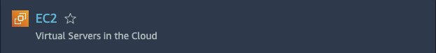
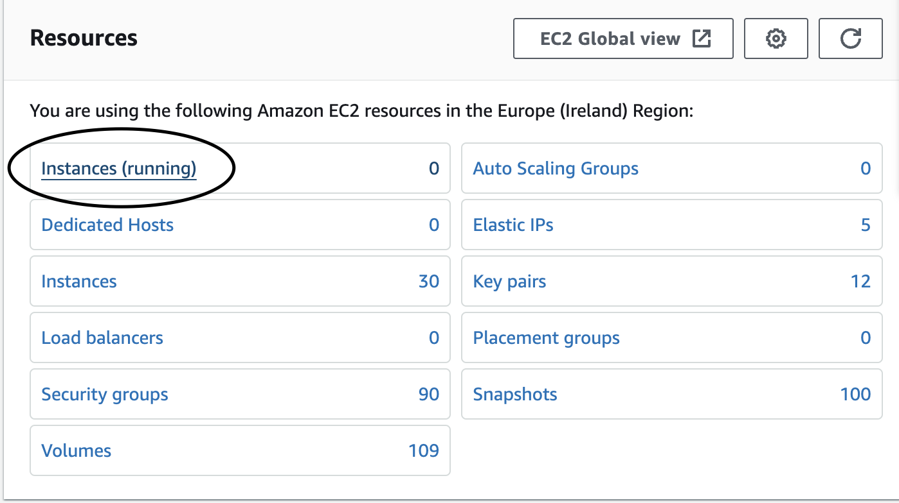
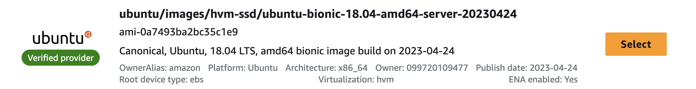
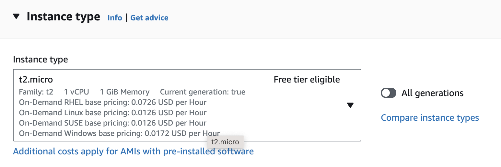
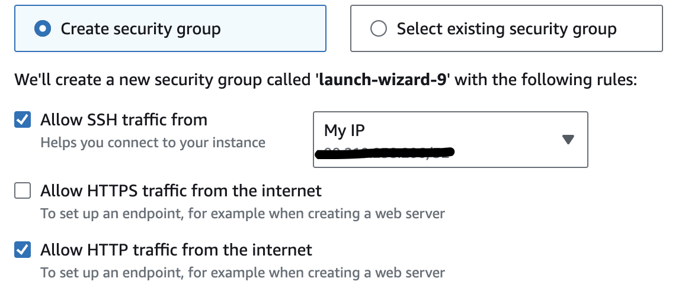
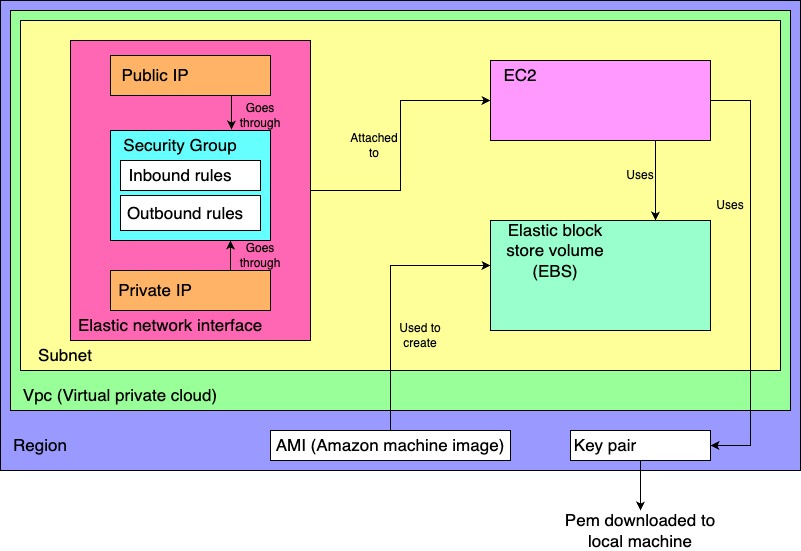

## Setting up a virtual machine

# Steps to set up a VM
1) The first thing you need to do to set up a virtual machine through AWS is to login to your AWS account.
2) Next you want to ensure your region in the top left corner is correct, for us we want Ireland.
3) Once you have set your region you want to navigate to the search bar at the top and enter "EC2" and select the option that says "Virtual Servers in the Cloud". 

1) You should then click on "Instances (running)" under resources. 

1) Now click "Launch instances" in the top left corner (may say create if using Azure). 

1) Give your VM a name, we used tech242-ourNames-whatItDoes
2) Next select your AMI (Amazon Machine Image), you can select whichever option you need, but we used ubuntu/images/hvm-ssd/ubuntu-bionic-18.04-amd64-server-20230424 which has the ami code of ami-0a7493ba2bc35c1e9.
The easiest way to find it is to click on "browse more AMIs", then click "Community AMIs", then in the search bar enter "20230424" and press enter, you should now have a list of 15 that you can search through and find the one with the matching AMI code. When you find it simply click the "select" button next to it on the right hand side. 

1) Now you can select your instance type, we used t2.micro but you can use whichever you like (assuming you are happy with the cost). 

1) Select the key pair you need or create a new one if you dont have one.
2)  You can either select an existing security group or create one, we created one by clicking "Create security group" then ticking "Allow SSH traffic" and changing the box that says "Anywhere" to "My IP" which means the VM is only able to be accessed by SSH if its coming from my current IP. We then ticked the "Allow HTTP traffic from the internet", and finally we clicked edit on the network settings and gave our security group a name so we can find it easily if we want to reuse it in the future. 

1)  You can then change the allocated amount of storage on your VM if you want to, but we left ours on the default value.
2)  Finally you can check everything is correct in the summary on the right, and if it is click on "Launch instance".
3)  Congratulations! Your VM is now set up, you can navigate back to the "Instances" page that we saw earlier and find your instance (VM). If you click on the "Instance ID" of your VM you will be taken to a screen that will show you much more information about it and if you click on "Instance State" in the top right corner you can start or stop your instance.

Here is a diagram that might make the process a little more understandable.  
