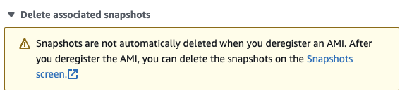
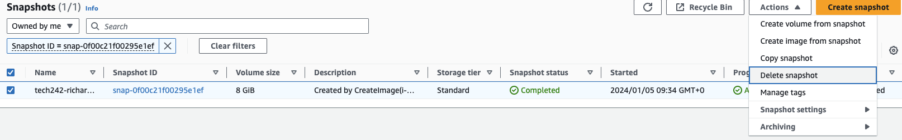

## Removing an AMI

To remove an AMI:
1) Navigate to the "AMIs" option under "Images on the left hand side of your screen.
2) Then click on the "AMI ID" for the AMI you want to delete.
3) Then click on "Actions" and the "deregister AMI".
4) You will then be shown a popup, simply click the "delete associated snapshot" dropdown and then click on the link to the snapshots screen. 
   
5) Then go back to the AMI window and click "deregister AMI".
6) Then go to the snapshots screen, it will have already filtered to only display the assosiated snapshots, and delete them by ticking all their boxes and then clicking "actions" at the top and choosing "delete snapshot". 
   

It is VERY important to delete all the associated snapshots as they will still take up resources even if they are not being used or associated with an AMI!