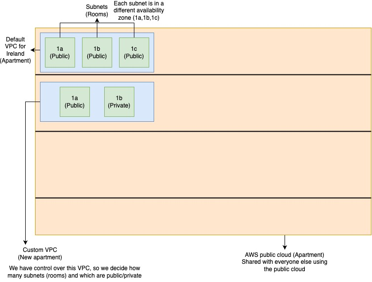

## AWS VPC's

- VPC stands for virtual private cloud (on Azure a vpc is called a virtual network)
- The default AWS VPC is all public, like a shared flat.
- Each subnet in the vpc is like a room and are all public in the default vpc.
- Each subnet is in a differant availabilty zone.
- If we make our own VPC we can choose which subnets(rooms) are public and which are private.
- A private subnet can still be accessed by other devices in the same VPC by default but not by anything outside the VPC.
- The route table says what can and can't access other devices.
- We can make a custome route table if we want to, so for example we can allow access to our public subnet from the internet.

# CDIR block's
- CDIR blocks are a way to say which IP's are used by a VPC or subnet.
- We can use a CDIR block like this `10.0.0.0/16`, each number is 8 bits and the number after the `/` states how many bits are locked, so in this case the first 2 numbers are locked but the last 2 numbers can be anything from 0 to 255. 

# Default VPC Diagram
 

As you can see from this diagram AWS gives you a VPC by default which is great because it means you have no set up to do. 
However it sets all of your subnets to public which isn't very secure, so we can create custom VPC's if we want to change that. 
[Click here to find out how to set up your own VPC's](../setting-up-custom-vpc's/README.md)