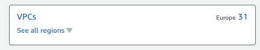
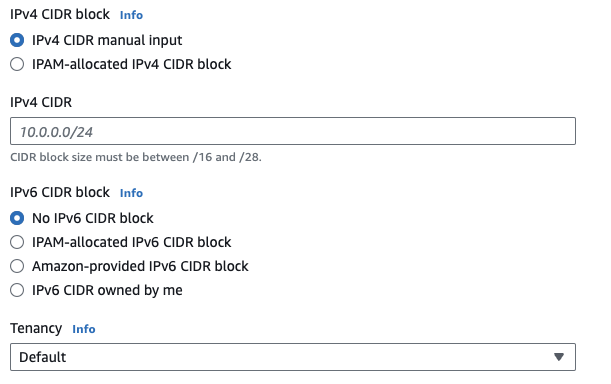
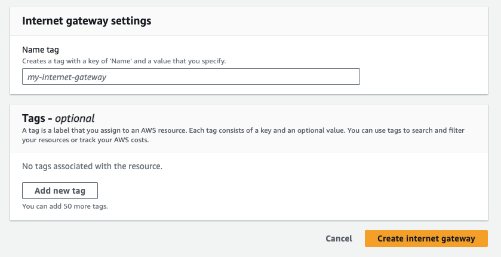
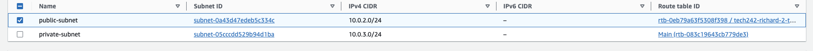
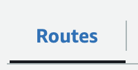

## Setting up custom VPC's

# Diagram
Hopefully this diagram will help you to understand hot the VPC fits together but we will go through it step by step while we set one up. 
 

# Set up a VPC
1) Create the VPC:
    1) To create a VPC the first thing you need to do is go to the VPC section on the AWS console, the easiest way to do that is to simply type "VPC" into the search bar at the top and select the "VPC option, as shown here: 
     
    2) Once you are in the VPC section, you then need to click on the VPC option, shown here: 
     
    3) Now click on the "Create VPC" button in the top right corner, shown here: 
     
    4) This will open the page to create a vpc, we just need to select a few options, first select "VPC only", shown here: 
     
    We are doing this because we are going to manually create the subnets and route tables, rather than having them automatically generated.
    5) Now we need to giv our VPC a name, make sure it is a name that will let you you and other people know what this VPC is for, once you have decided on a name simply enter it into the name section, shown here: 
     
    6) Now we need to select a CDIR block, if you are not familiar with CIDR blocks you can find some more information about them here - [CDIR blocks](../aws-vpc's/README.md) 
    Once you have decided on a CDIR block simply enter it into the "IPv4 CIDR" section, shown here  
    
    7) Now just click the "Create VPC" button at the bottom, shown here: 
     
    Your VPC will now be created. 
2) Create subnets:
   1) Now we will create our subnets, to do this we first need to go to the "subnets" section on the left hand side, shown here: 
    
   2) Now click the "Create subnet" button in the top right, shown here: 
    
   3) This will take you to the subnet setup screen, all we need to do is select the VPC we just made from the dropdown, shown here: 
    
   4) Once you have selected your VPC you will need to give your subnet a name, availability zone and CDIR block by filling in the options shown here: 
    
   It's a good idea to choose differant availability zones for each of your subnets, so if one zone goes down you dont lose all of your subnets.
   5) Once you have filled in all of the settings for your subnet you can click the "Add new subnet" button at the bottom if you want to have more than one subnet in your VPC. 
   
   6) When you have added all of the subnets you neet and filled in all of their settings, just click "Create subnet" at the bottom, shown here: 
    
   Your subnet(s) will now be created.
3) Create an internet gateway:
   1) We now need to create an internet gateway so that at least part of our application can access the internet, the first step to do this is to go to the "Internet gateways" section by clicking the "Internet gateways" option on the left hand side, shown here: 
    
   2) Now just click the "Create internet gateway" button on the top right corner, shown here: 
    
   3) Give your internet gateway a name by filling in the name field, shown here: 
    
   4) Then click the "Create internet gateway button at the bottom, shown in the previous image, and your internet gateway will be created.
4) Attach the internet gateway to your VPC
   1) Now we need to attach our internet gateway to our VPC, to do this simply click on your internet gateway, then click "Actions" and select the "Attach to VPC" option, shown here: 
     
    2) You then need to select the VPC we just created from the dropdown.
5) Create route table:
   1) The first thing we need to do to create a route table is to go to the route table section by clicking the "Route tables" option on the left hand side, shown here: 
    
   2) Now click the "Create route table" button in the top right corner, shown here: 
    
   3) Now we need to give our route table a name and attach it to our VPC, by filling in the options shown here: 
    
   When naming a route table its a good idea to say which vpc it is for and whether it will be private(only accessable from inside the vpc) or public(accessable from outside the vpc).
6) Associate route table with subnet:
   1) To associate a route table with a subnet we need to select our route table and then go to the "Subnet associations" option, shown here: 
    
   2) You will see 2 tables one called "Explicit subnet associations" and one called "Subnets without explicit associations", we need to click on the "Edit subnet associations" button on the "Explicit subnet associations" table, shown here: 
    
   3) Now simply tick the subnet(s) you would like to be associated with this route table, like this: 
    
   4) Then click the "Save associations" buttons at the bottom, shown here: 
    
7) Add internet gateway to the route:
   1) You will now be returned to your route table details page, from here make sure you are on the routes tab, shown here: 
    
   2) From here click on the "Edit routes" button on the right hand side, shown here: 
    
   3) This will take you to a new page where you will need to click "Add route", selech "Internet gateway" from the first dropdown and your internet gateway from the second, so it will look similar to this but with the id of your internet gateway: 
    
   4) Now just click the "Save changes" button at the bottom, shown in the previous image.
8) Check VPC setup:
   1) Now we need to make sure our VPC is set up properly, to do this we first go to the "Your VPCs" option on the left hand side, shown here: 
   
   2) Then we need to find our VPC in the list, we can use the search bar to help with this.
   3) Once we have found our VPC we need to click on the id to open the details page of our VPC.
   4) Now we can scroll down to the bottom of the page and make sure we are on the "Resource map" tab, if we are we will be able to see our subnet(s), route table(s) and internet gateway(s) and how they all connect, it will look something like this: 
   
9) Setup DB VM:
    1) Setting up our Virtual machines is very similar to how we have done it before, you can find the details for that here - [Setting up a VM](../../../week1/day2/setting-up-a-vm/README.md). 
    However in the network settings you will need to click the "Edit" button so that you can select your VPC, the subnet you would like your VM in and whether it needs a public IP, you will also need to create a new security group as any you have created previously are liked to a different VPC. 
     
    Remember our database virtual machine will be in a private subnet, so it will have no access to the internet, therefore you will not be able to use commands that require internet access so its a good idea to use an AMI that already has everything installed. 
    Our DB VM will also not need a public IP because it is only accessed by our API VM.
10) Setup API VM:
    1) Setting up our API VM will be very similar to creating our DB VM, however we will need to put it in our public subnet as it will be accessed from outside of our VPC and therefore will need a public IP. 
    2) As this VM can connect to the internet we will be able to use commands like "update" and "install", however it is still a good idea to make an AMI because it is faster.