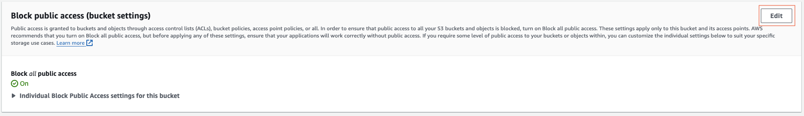
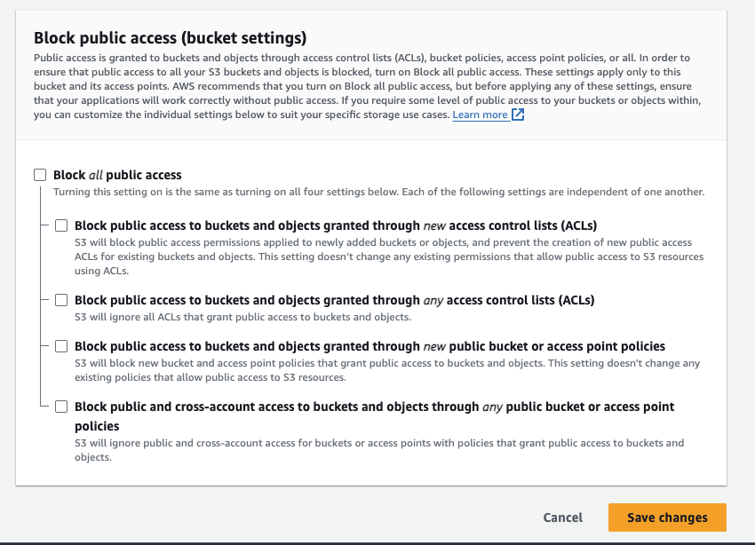
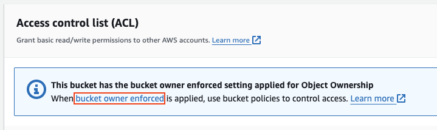
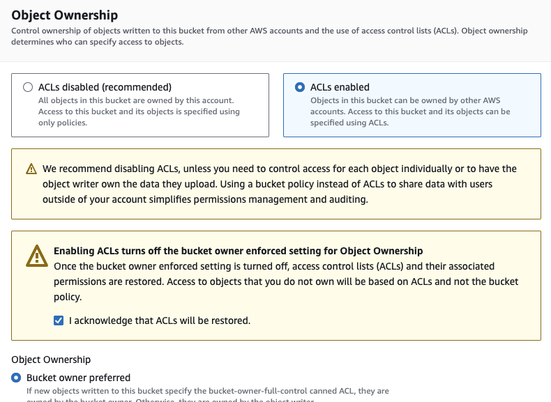

# S3 storage

S3 storage is an AWS service that allows you to store things in containers called buckets or containers in azure, the files in your bucket are called objects or blobs in azure.

## Installing AWS command line
1) When using S3 storage on your terminal you will first need to install AWS command line interface with the command: `sudo apt install awscli -y` (you will need to add noninteractive if you are using this in a script).
2) You can check it installed with the command `aws --version`.
3) You will then need to log in by using the command `aws configure` and then entering your access key, then your secret access key, your default region (we used eu-west-1) and finally the default output format (I used json).
4) Now you can check it worked with the command `aws s3 ls` to show all buckets.

## Creating buckets
The command to create a bucket is `aws s3 mb s3://name-of-bucket` use only lowercase letters in your bucket name.

## Putting objects in your bucket
- To put an object into a bucket use the command `aws s3 cp file-name.txt s3://name-of-bucket`.
- You can use the command `aws s3 ls s3://name-of-bucket` to list all the objects in your bucket.

## Downloading objects from your bucket onto your machine
1) First make a folder to store the downloaded objects into using `mkdir nameOfDirectory`.
2) Then `cd` into that directory.
3) then use the command `aws s3 sync s3://name-of-bucket .` to download everything from that bucket into your current directory (the `.` signifiys your current directory but you could use a path instead).

## Deleting buckets and their contents
BE VERY VERY CAREFUL WITH THESE COMMANDS, ESPECIALLY THE LAST ONE!
- To delete an object from a bucket use the command `aws s3 rm s3://name-of-bucket/file-name.txt`.
- To delete all objects from a bucket use the command `aws s3 rm s3://name-of-bucket --recursive`.
- To deleta an empty bucket use the command `aws s3 rb s3://name-of-bucket`.
- To deleta a bucket and its contents use the command `aws s3 rb s3://name-of-bucket --force`.

## Making a bucket public - through the console
1) Go to your bucket.
2) Click permissions. 
   
3) Click the edit button in the block public access section. 
   
4) Uncheck all the boxes and click "Save changes" (you will get a pop-up asking you to confirm by writing 'confirm'). 
   
5) Scroll down to the access control list section and follow the link. 
   
6) Select "ACL's enabled", tick that you acknowledge and click save. 
   
7) Go to the object tab, tick the objects you want to make public, click actions, click "make public using ACL" and confirm.

## How does S3 storage provide redundancy, high availability and help with disaster recovery?
Amazon S3 (Simple Storage Service) provides redundancy, durability and help with disaster recovery through a combination of data replication, error checking, and automatic healing mechanisms. The primary features that contribute to the redundancy and durability of data in Amazon S3 are:

1) Data Replication:
Amazon S3 automatically replicates your data across multiple geographically distributed Availability Zones (AZs). An Availability Zone is a physically separate data center with independent power, cooling, and networking infrastructure. This replication across AZs helps protect your data from hardware failures, power outages, and other localized events.

2) Multiple Copies of Objects:
Each object stored in Amazon S3 is redundantly stored on multiple devices within an AZ. Amazon S3 maintains multiple copies of each object across different devices to ensure data durability and availability.

3) Checksums and Error Detection:
Amazon S3 uses checksums to detect and correct errors in data during both storage and retrieval. Checksums are mathematical values computed from the content of the data, and they are used to verify data integrity. If an error is detected in one copy of the data, Amazon S3 automatically retrieves a copy from another location.

4) Versioning:
Amazon S3 supports versioning, which allows you to keep multiple versions of an object in the same bucket. This feature helps protect against accidental deletions or overwrites by maintaining a history of changes to objects.