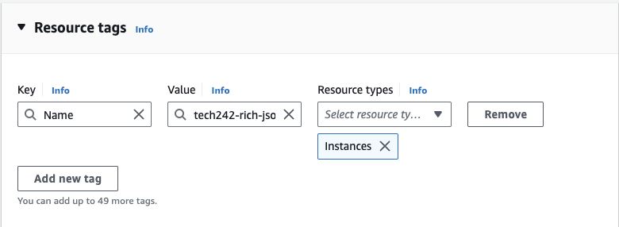
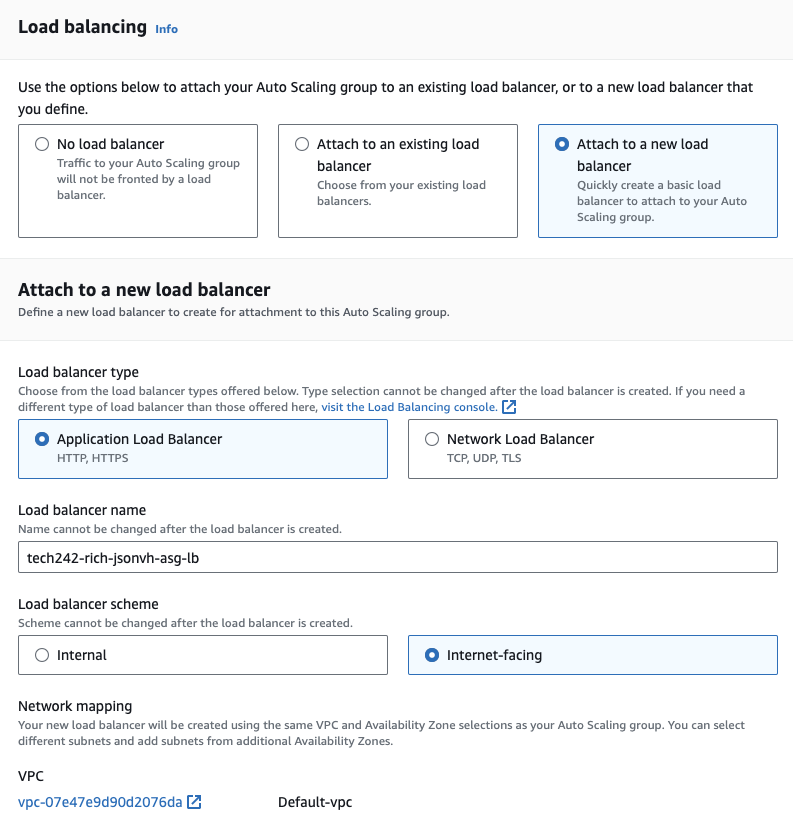
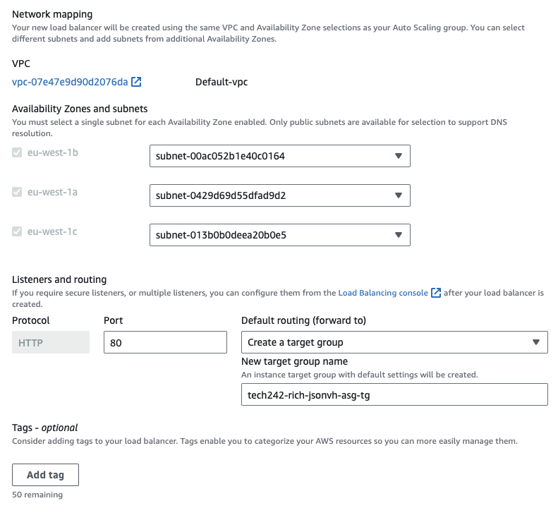
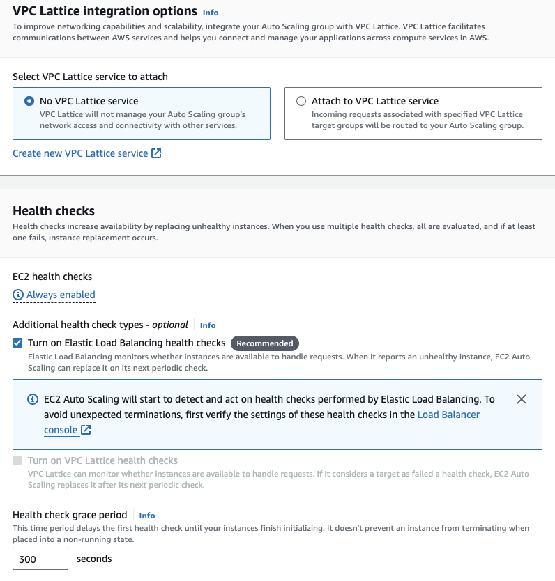
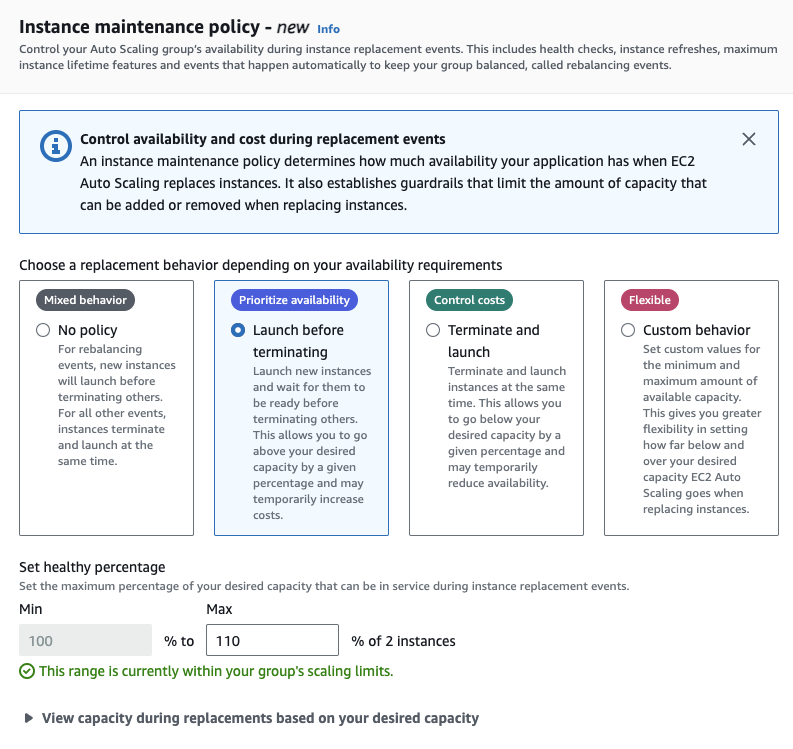
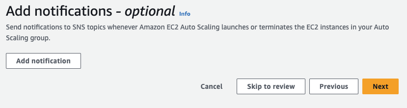
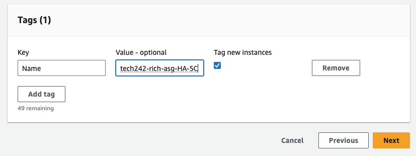

## Auto scaling groups

# How auto scaling groups work

# How to create an auto scaling group
1) You will first need a working and tested VM, to do this you can follow the steps here: [Setting up a vm](../../../week1/day2/setting-up-a-vm/README.md)
2) You will then need to make an AMI from that VM, to do this you can follow the steps here: [Creating AMI's](../../../week1/day5/creating-ami's/README.md)
3) You Then need to make a launch template. 
   1) To do this simply navigate to the "Launch templates" section in the AWS console, and click on "Create launch template"
   2) Give your launch template a name, select the AMI you wish to use, the instance type, the key pair, a security group and enter any user data you need to run the app, just like creating an instance from an AMI.
   3) Then click "Create launch template"
4) Now test the launch template by:
   1) Going to the launch templates details
   2) Click on actions
   3) Click on launch instance from template
   4) Check all the details are correct 
   5) Add a name tag
   
   6) Click "launch instance"
   7) Go to the new instances public IP and seeing if it is working, it may take a few minutes to load.
   8) If it works you can terminate that instance
5) Now make your auto scaling group by:
   1) Go to the "Auto scaling groups" section of the AWS console
   2) Click "create auto scaling group"
   3) Give your auto scaling group a name and select the launch template we just made and click next
   
   4) Select the availability zones you want your VM's to be created in and click next
   
   5) Click attach to a new load balancer
   6) Select the type of load balancer (we used Application load balancer)
   7) Give your new load balancer a name
   8) Select a load balancer scheme (we used internet facing)
   
   9)  Select create new target group from the default routing dropdown
   10) Name your new target group
   
   11) Click the checkbox for turn on Elastic Load Balancing health checks and click next
   
   12) Select your desired, min and max capacitys, we chose 2, 2 and 3
   13) Select Target tracking scaling policy
   
   14) Select a Instance maintenance policy and click next
   
   15) Set up notifications if you want to (we didn't) and click next
   
   16) Add a name tag and click next
   
   17) Check all the settings and click create
6)  Now test your auto scaling group by:
    1) Going to your loadbalancer and copying the DNS name and pasting it into your search bar (it may take a minute to load)

# Deleting auto scaling groups
To delete auto scaling groups:
1) Delete the load balancer
2) Delete the target group
3) Delete the auto scaling group
4) (Optional) Delete the launch template