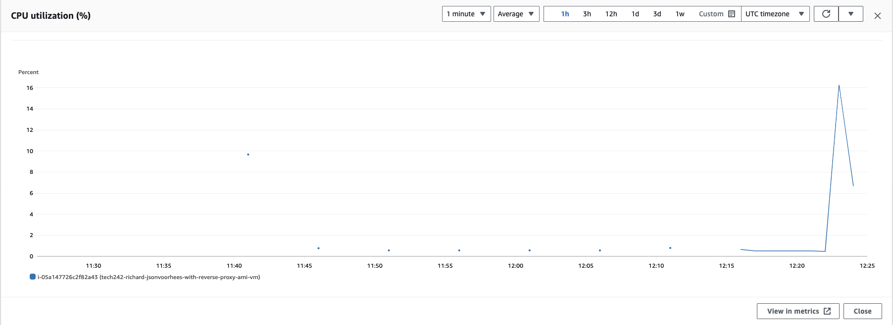

## Monitoring and alert management

# Monitoring
Monitoring is a way to keep track of the resources your VM is using. AWS gives you some monitoring by default, but it only gives you data every 5 minutes, if you want more constant data you will need to play extra for detailed monitoring and you will be able to get data every minute.

# Setting up detailed monitoring:
1) First go tou your instance details on the AWS dashboard.
2) Then scroll down and click on the "Monitoring" tab. 
    
3) Now click on "Manage detailed monitoring" on the right hand side. 
    
4) Click the enable checkbox and then confirm. 
    
5) You now have detailed monitoring, which means you will recive data every minute, however the graphs on screen will not automatically reflect that. You will need to create a dashboard for that.

# Creating a dashboard
1) First click on "Add to dashboard" under "Manage detailed monitoring". 
    
2) This will take you to a new screen where you can choose an existing dashboard or create a new one.
3) To create a new one simply click the "Create new dashboard" button and give it a name.
4) Your new dashboard will be automatically selected when you finish creating it.
5) Click confirm and it will take you to your dashboard.
6) Open one of your graphs by hovering over it and clicking the expand button. 
    
7) Then at the top it will say 5 minutes, simply click on it and change it to 1 minute. 
    
8) Your graph will now refresh with new data every minute.