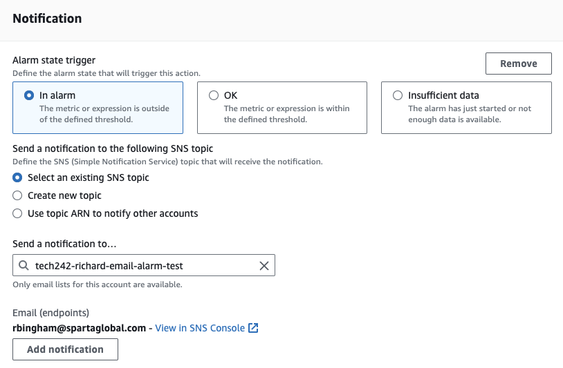

## Monitoring and alert management

# Monitoring
Monitoring is a way to keep track of the resources your VM is using. AWS gives you some monitoring by default, but it only gives you data every 5 minutes, if you want more constant data you will need to play extra for detailed monitoring and you will be able to get data every minute.

# Setting up detailed monitoring:
1) First go tou your instance details on the AWS dashboard.
2) Then scroll down and click on the "Monitoring" tab. 
    
3) Now click on "Manage detailed monitoring" on the right hand side. 
    
4) Click the enable checkbox and then confirm. 
    
5) You now have detailed monitoring, which means you will recive data every minute, however the graphs on screen will not automatically reflect that. You will need to create a dashboard for that.

# Creating a dashboard
1) First click on "Add to dashboard" under "Manage detailed monitoring". 
    
2) This will take you to a new screen where you can choose an existing dashboard or create a new one.
3) To create a new one simply click the "Create new dashboard" button and give it a name.
4) Your new dashboard will be automatically selected when you finish creating it.
5) Click confirm and it will take you to your dashboard.
6) Open one of your graphs by hovering over it and clicking the expand button. 
    
7) Then at the top it will say 5 minutes, simply click on it and change it to 1 minute. 
    
8) Your graph will now refresh with new data every minute.

# Setting up an alarm for CPU utilization
1) Open the CloudWatch console at https://console.aws.amazon.com/cloudwatch/.
2) In the menu on the left hand side, choose Alarms, All Alarms.
3) Choose Create alarm.
4) Choose Select metric.
5) In the All metrics tab, choose EC2 metrics.
6) Choose a metric category (I chose Per-Instance Metrics).
7) Find the row with the instance that you want listed in the InstanceId column (using the search bar) and select the one with CPUUtilization in the Metric Name column. Select the check box next to this row, and choose Select metric.
8) Under Specify metric and conditions, for Statistic choose Average.
9) Choose a period (I used 1 minute).
    
10) Under Conditions, specify the following:
    1) For Threshold type, choose Static.
    2) For Whenever CPUUtilization is specify greater, specify the threshold that is to trigger the alarm to go to ALARM state if the CPU utilization exceeds this percentage. I used 10 for this test but you would ususally want it higher.
11) Choose Next.
    
12) Under Notification, choose In alarm and select an SNS topic to notify when the alarm is in ALARM state
    1) You may need to create a new email topic, to do this simply click create new topic.
    2) Than give it a name and the email adress you want the notification to go to.
13) To have the alarm send multiple notifications for the same alarm state or for different alarm states, choose Add notification.
14) To have the alarm not send notifications, choose Remove.
15) When finished, choose Next.
    
16) Enter a name and description for the alarm. Then choose Next.
    
17) Under Preview and create, confirm that the information and conditions are what you want, then choose Create alarm.
18) You will need to go to your email and follow the link to subscribe to the alarm.
19) Once you have done this you can go to your application and try to increase the CPU load to test it, you can do this by refreshing a lot or SSHing into your VM and running commands like update and upgrade.
20) Once the CPU load is high enough you should recive an email like this one.

