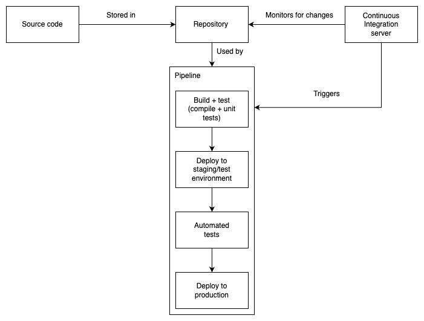
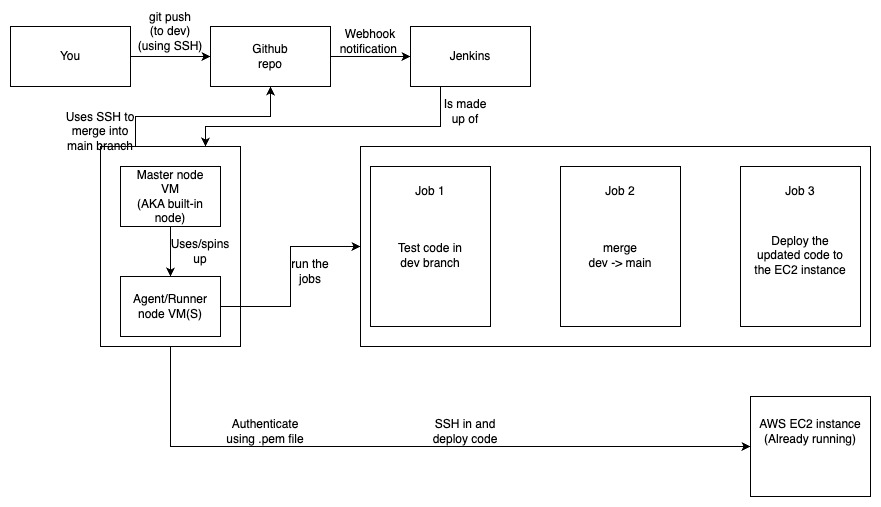

# CI/CD with Jenkins
## What is CI?
CI refers to the practice of regularly and automatically integrating code changes from multiple contributors into a shared repository. The goal is to detect and address integration issues early in the development process.

## What is CD?
Continuous Delivery is a DevOps practice that focuses on automating the software delivery process to ensure that software can be reliably and rapidly delivered to production at any time. The goal of Continuous Delivery is to make the software release process more efficient, reliable, and less error-prone. It involves automation of the entire delivery pipeline, from code integration and testing to deployment.

Continuous Deployment is an extension of Continuous Delivery. While Continuous Delivery ensures that the software is always in a deployable state, Continuous Deployment takes it a step further by automatically deploying every change that passes the automated tests directly to production without manual intervention. This approach aims to minimize the time between development and the delivery of new features or bug fixes to end-users.

## What is the difference between CD and CDE
CDE is Continuous delivery/deployment environment witch is all the tools involved in CD, like jenkins, maybe EC2 instances ect

## What is Jenkins?
Jenkins is an open-source automation server commonly used for building, deploying, and automating projects. It facilitates Continuous Integration (CI) Continuous Delivery (CD) and Continuous Deployment (CD) practices by automating the building, testing, and deployment of code changes.

## Why use Jenkins? What are the benefits and disadvantages?
Advantages:

    - Automation: Jenkins allows developers to automate various parts of the software development process, such as building code, running tests, and deploying applications.

    - Integration: Jenkins integrates with version control systems (e.g., Git, SVN) and various build tools, making it versatile and compatible with a wide range of development environments.

    - Plugins: Jenkins supports a rich ecosystem of plugins that extend its functionality. These plugins cover integrations with various tools, enabling users to customize and extend Jenkins to suit their specific needs.

    - Pipeline: Jenkins supports the definition of build and deployment pipelines, allowing users to describe the steps and dependencies in their software delivery process. This feature is crucial for implementing Continuous Delivery practices.

    - Monitoring and Reporting: Jenkins provides dashboards and reports to monitor the status of builds, tests, and deployments. This visibility helps teams identify issues and trends in their development processes.

    - Community Support: Being open source, Jenkins has a large and active community. Users can find documentation, tutorials, and community support to help with their Jenkins implementations.

Disadvantages:

    - Steep Learning Curve: Jenkins can have a steep learning curve for beginners, especially those who are new to CI/CD concepts and automation. Configuring and managing Jenkins instances, creating pipelines, and understanding plugin configurations may require some time and effort.

    - Maintaining and Upgrading: Managing Jenkins instances, plugins, and configurations can become complex, particularly as the number of projects and builds increases. Upgrading Jenkins and its plugins while ensuring compatibility with existing configurations can be challenging.

    - Resource Consumption: Depending on the number of builds and the complexity of pipelines, Jenkins instances may consume a significant amount of system resources. This can lead to performance issues and may require careful resource management.

    - Security Concerns: Jenkins security depends on proper configuration and management. If not configured securely, Jenkins instances can be vulnerable to security threats. Regular updates, proper access controls, and secure configurations are crucial for maintaining a secure Jenkins environment.

    - Lack of Built-in Deployment Capabilities: Jenkins is primarily focused on Continuous Integration, and while it supports Continuous Delivery, it may lack some of the built-in deployment capabilities found in more modern CI/CD tools.

    - Dependency on Plugins: While the plugin ecosystem is a strength, it can also be a source of challenges. Some plugins may become outdated, and maintaining compatibility with the latest Jenkins releases may require updates or replacements.

## Stages of Jenkins
In Jenkins, the concept of "stages" is commonly associated with pipeline-based builds, specifically using Jenkins Pipeline. Jenkins Pipeline is a powerful suite of plugins that allows you to define an entire build process as code, enabling the creation of complex and customizable build pipelines.

The stages in Jenkins Pipeline represent different phases or steps in the build and deployment process. A typical pipeline might include stages such as:
    - Building the code, this stage is responsible for compiling the code and creating the necessary artifacts.
    - Running tests, this stage runs automated tests to ensure the quality of the code.
    - Deploying to a staging environment, this stage deploys the application to a staging environment for further testing.
    - Deploying to production, this stage deploys the application to the production environment.
Each stage consists of one or more steps, and the entire pipeline is defined in a script.

## What alternatives are there for Jenkins
    - CircleCI
    - TeamCity
    - Bamboo
    - Gitlab
    - Azure devops
    - Github actions

## Why build a pipeline? What is the business value?
- Faster Time to Market:
    - CI/CD pipelines automate the building, testing, and deployment processes, reducing the time it takes to release new features or updates.
    - Faster delivery to production means quicker response to market demands and the ability to stay ahead of competitors.

- Improved Code Quality:
    - Automated testing in the pipeline helps catch bugs and issues early in the development process, reducing the likelihood of defects reaching production.
    - Consistent and automated code reviews as part of the pipeline can enforce coding standards and best practices.

- Reduced Manual Effort:
    - Automation of repetitive tasks in the CI/CD pipeline reduces manual effort, minimizes human errors, and allows development teams to focus on more value-added activities.
    - Manual deployments are error-prone and time-consuming, and automation streamlines this process.

- Enhanced Collaboration:
    - CI/CD promotes collaboration between development, testing, and operations teams by providing a standardized and automated process.
    - It encourages communication and transparency, as teams can see the status of builds and deployments in real-time.

- Increased Deployment Frequency:
    - CI/CD enables organizations to deploy changes more frequently, leading to a more agile and responsive development cycle.
    - The ability to release small, incremental updates reduces the risk associated with large, infrequent releases.

- Improved Reliability and Stability:
    - Automated testing and deployment processes help ensure that each release is thoroughly tested and meets quality standards before reaching production.
    - Rollback mechanisms in CI/CD pipelines provide a quick way to revert to a stable state in case of issues.

- Cost Savings:
    - Automation reduces the need for manual intervention, which can lead to cost savings in terms of time and resources.
    - The early detection of issues in the development cycle can prevent costly defects from reaching production.

- Scalability:
    - CI/CD pipelines are scalable and can accommodate the increasing complexity of software projects.
    - They support the growth of development teams and the addition of new features without sacrificing efficiency.

- Compliance and Security:
    - CI/CD pipelines can enforce security and compliance policies by incorporating security scans and checks into the development process.
    - Compliance requirements can be consistently addressed and validated through automated processes.

- Customer Satisfaction:
    - Faster delivery of new features and bug fixes leads to a better customer experience, enhancing customer satisfaction.
    - The ability to respond quickly to customer feedback and market demands contributes to a positive customer relationship.

## Diagram of CICD

## Diagram of CICD with Jenkins
