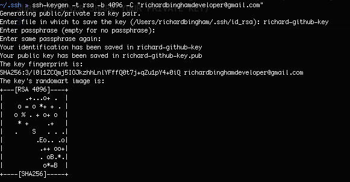

## Using ssh to push to github
# Setup SSH to push to github
1) Generate a new ssh key pair
   1) Use the command `ssh-keygen -t rsa -b 4096 -C "youremail@email.com"` to generate a new key pair
   2) when prompted enter the name for your key pair files (make them descriptive)
   3) If you do not want a passphrase simply press enter twice
   
2) Do an `ls`, you should see 2 new files, 1 with the name you provided and 1 with the same name but ending in .pub. The one ending in .pub is your public key the other is your private key (MAKE SURE TO NEVER SHARE YOUR PRIVATE KEY)
3) Now go to github and login
4) Navigate to your settings by clicking on your profile picture in the top right and selecting settings.
5) Then click on SSH and GPG keys on the side 
   
6) Click Add SSH key 
   
7) Give it a name, I recommend using the same name as you gave the key on your local machine
8) Go back to your terminal and use the command `cat your-key-name.pub`, make sure it ends in .pub as we want your public key 
   
9)  Copy the output of that command, it should begin with `ssh-rsa` and end with your email
10) Paste that into the key textbox in the github settings and make sure there is no extra whitespace at the beginning or end
11) Click "add ssh key"
12) Now go back to your terminal and use the command `eval ssh-agent -s` with backticks around ssh-agent -s 
    
13) It shout return `Agent pid` followed by a number
14) Now use the command `ssh-add your-key-name`, this will add your key to the ssh register 
    
15) Now use the command `ssh -T git@github.com`, to make sure you can connect to github if you get a prompt simply enter `yes` 
    
16) Your ssh key should now work, to test it simply create a new empty repo on github, select ssh here: 
 
and follow the instructions given to you by github.