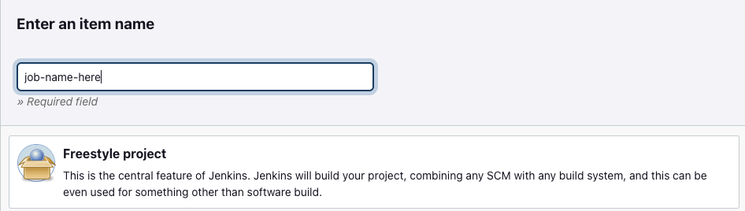
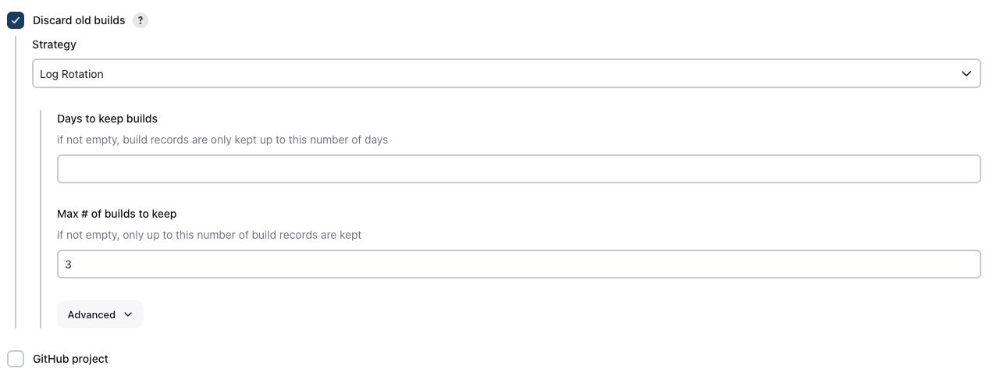
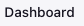

# Creating jobs and pipelines with jenkins
Creating jobs with jenkins
1) if it is the first job on a jenkins server you need to click on "create new job" in the centre of the screen, otherwise click on "new item" in the top corner.
2) Enter the name of your job and click on "freestyle project". 
   
3) Enter a description of the job.
4) Tick "discard old builds", and enter a number in the "max # of builds to keep" option. 
   
5) Scroll down to "add build step", click on the dropdown and select "Execute shell". 
    
6) Enter some linux commands in the commands box. 
    
7) Click save at the bottom. 
   
8) Your job has now been created.

# Building/running jobs
To build a job you can either:
1) Click on "Build now" on the left hand side. 
   
or
1) Click on "Dashboard" in the top corner. 
   
2) Hover over your job. 
   
3) Click on the arrow next to it to display the options. 
    
4) Click on "Build now".
   
# Checking your builds
1) Whichever way you build your job it will build/run but it may take a minute if it is a big job, it needs to spin up a new agent node vm or both.
2) When it is done just click on the job name, and you will be able to see the build history on the left hand side. 
   
3) Click on one of the builds and the "Console output" for more information. 
   

# Creating a pipeline
1) Create at least two jobs that you want to run one after the other.
2) In the dashboard, click on the first job you want to run.
3) Click the configure option on the left. 
   
4) Scroll to the bottom and click "Add post-build action", then select "Build other projects" (projects just means jobs). 
   
5) Find the job you want to run after this one and select "Trigger only if build stable". 
   
6) Repeat on the second job to run a third and so on.