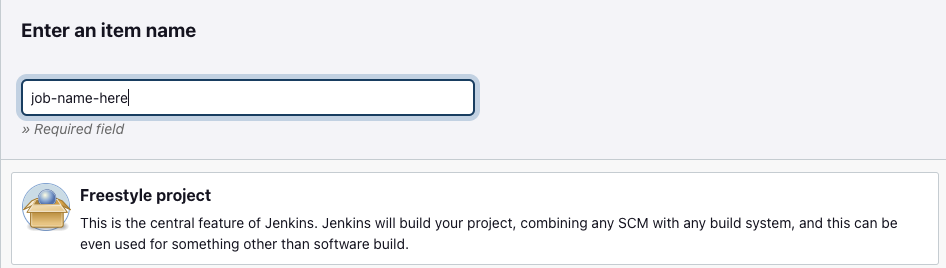
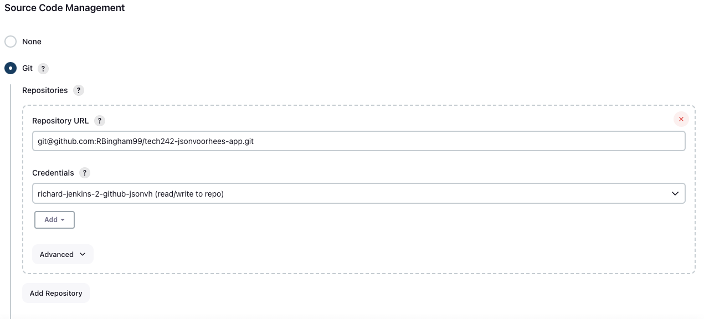
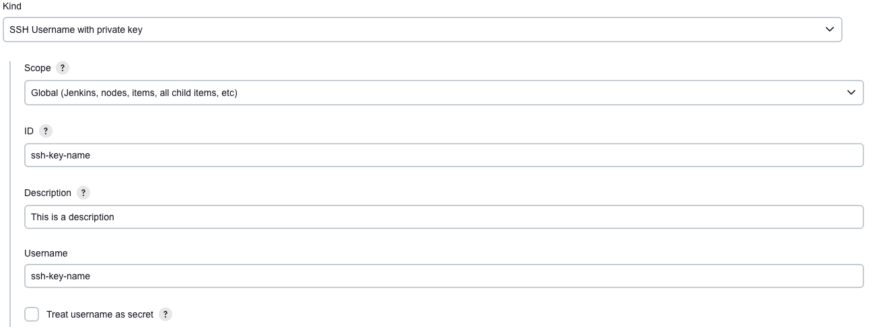
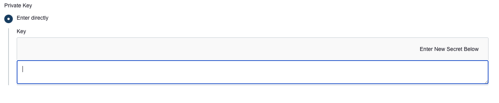
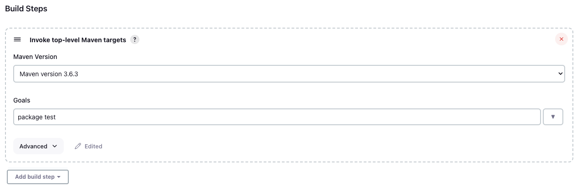
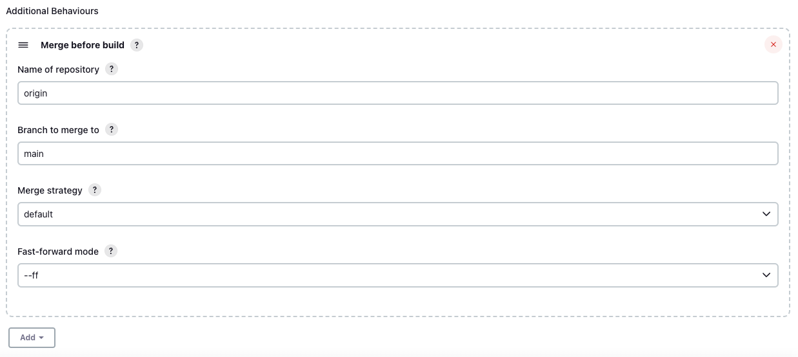
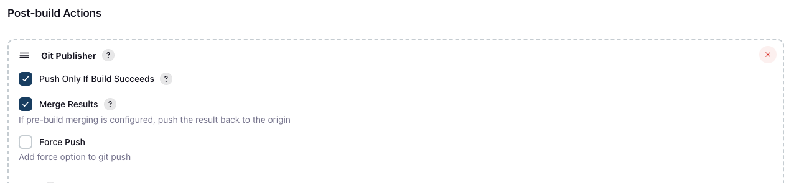
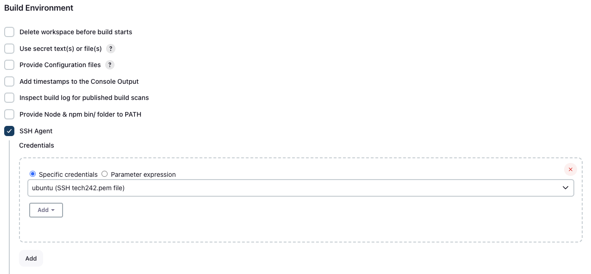
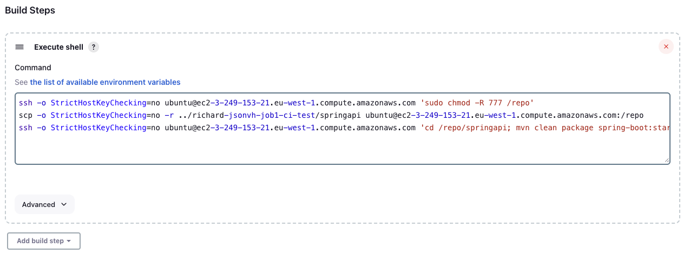
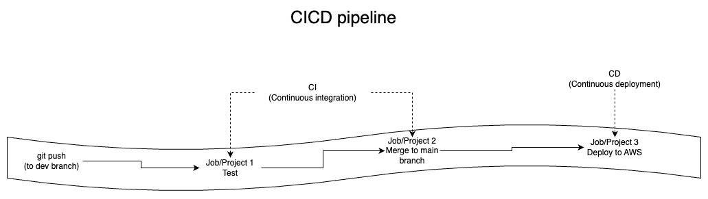

# Jenkins jobs for our first pipeline
## Job 1
Job 1 will run the tests on our jsonvh app.
To set it up:
1) Click "new item"
2) Enter the name of your job and click on "freestyle project". 
   
3) Give the job a description
4) Tick "discard old builds", and enter a number in the "max # of builds to keep" option. 
   
5) Click "github project" and enter the repositories HTTPS URL
6) Scroll down to "Source code management" and select "Git"
7) Under "Repository URL" paste in the repositories SSH URL 
   
8) Then click the add button and Jenkins and set up the credentials by:
   1) Changing the "kind" to "SSH Username with private key" 
   2) Enter the name of your SSH key into both the "ID" and "Username" boxes
   3) Enter a description in the "description" box 
   
   4) Click "Enter directly" under "Private key"
   5) Click the blue "add" button
   6) Then go to your terminal and navigate to the folder your key is stored in
   7) Use the command `cat name-of-your-key` without the .pub at the end, as we need the private key
   8) Copy the output of the command, from the first - to the last -
   9) Paste that into the "Key" box and click "add" 
   
9)  In the "Branches to build" section, change "Branch Specifier" to "*/dev"
10) Scroll down to "Build steps", click on "Add build step" and select "Invoke top-level Maven targets" 
    
11) Select the maven version you are using
12) In goals type the maven command you want to use, I used "package test" 
    
13) Now click save and you can run your job to see if it works

# Job 2
Job 2 will merge the changes from the dev branch into the main branch, if job 1 was succesfull.
To set it up:
1) Click "new item"
2) Enter the name of your job and click on "freestyle project". 
   
3) Give the job a description
4) Tick "discard old builds", and enter a number in the "max # of builds to keep" option. 
   
5) Click "github project" and enter the repositories HTTPS URL
6) Scroll down to "Source code management" and select "Git"
7) Under "Repository URL" paste in the repositories SSH URL 
   
8) Select the credentials we made earlier
9) In the "Branches to build" section, change "Branch Specifier" to "*/dev"
10) Click "Add additional behaviours" and select "Merge before build"
11) Enter "origin" as "Name of repository"
12) Enter "main" as "Branch to merge to" 
    
13) Scroll down, click on "Add post-build action" and select "Git publisher"
14) Tick "Push Only If Build Succeeds" and "Merge Results" 
    
15) Click save
16) Navigate to the configure section for job 1
17) Scroll to the bottom, click "Add post-build action" and select "Build other projects"
18) Choose job 2 and set to "Trigger only if build is stable"

# Job 3
Job 3 will deploy the changes onto our already deployed app.
To set it up:
1) First deploy your application through AWS, this is just like we have done before but we will need to change the security group to allow ssh from the jenkins machine, to do this:
   1) Select custom from the sources option in the ssh section of your security group settings.
   2) Go to the master node for jenkins
   3) Navigate to its subnet
   4) Copy the CIDR block 
   5) Paste it into the CIDR block section on the ssh section of your security group
2) Go to jenkins and create a new job like before
3) Give the job a name and select freestyle
4) Give the job a description, tick "discard old builds" and set "max # of builds to keep" to 3 like before
5) Scroll down to "build environments" and select "SSH agent"
6) Select the pem file you will need to ssh into the EC2 instance under "credentials" (you may need to add credentials like we did on job 1)
   
7) Scroll down to "Build steps" and select "Execute shell" 
8) Inside the command box you will need a few commands:
   1) You may need to change the permissions on the app file on the EC2 instance so you will need:
   `ssh -o StrictHostKeyChecking=no username@hostAddress 'sudo chmod -R 777 /reponame'`
   2) Then you need to Copy the file from the Jenkins worker node to the EC2 instance with a command like this:
   `scp -o StrictHostKeyChecking=no -r ../path/to/file/on/jenkins username@hostAddress:/reponame`
   3) Then you need to re-package/re-run the app with the updated code using a command like this:
   `ssh -o StrictHostKeyChecking=no username@hostAddress 'cd /path/to/folder/containing/pom; mvn clean package spring-boot:start'` 
   

## Diagram of this CICD pipeline
